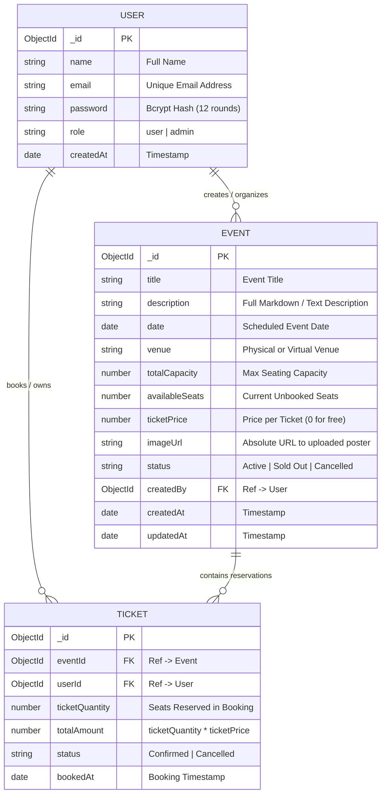

# SLIIT — Faculty of Computing | SE2020 Web & Mobile Technologies
## Individual Assignment: Full Stack Mobile Application
### Project Report, System Architecture, Deployment Guide & Viva Defense Compendium

---

## 📋 Executive Overview & Assignment Mapping

| Item | Specification |
|---|---|
| **Module** | SE2020 — Web and Mobile Technologies |
| **Year / Semester** | Year 2 Semester 2 (2026) |
| **Weightage** | 20% of continuous assessment (100 scaled marks: 40 Code + 60 Viva) |
| **Selected Topic** | **Event Booking System** (Primary: `Event` → Related: `Ticket`) |
| **Frontend** | React Native (Hooks, Functional Components, React Navigation, Axios) |
| **Backend** | Node.js + Express.js (Modular MVC: Routes, Controllers, Models, Middleware) |
| **Database** | MongoDB Atlas (Mongoose ORM with Schemas, References, and Pre-hooks) |
| **Image Upload** | Multer Middleware (Local `/uploads` with MIME verification & cleanup) |
| **Authentication** | Password hashing (`bcryptjs` 12 rounds) + JWT Bearer Tokens |
| **Deployment Target** | Render / Railway (API) + MongoDB Atlas (Cloud Cluster) |

---

## 1. Problem Statement & System Objectives

### 1.1 Problem Statement
In modern campus and commercial environments, event discovery and ticket reservation are often fragmented. Attendees face issues such as double-booking, lack of real-time seat transparency, difficult cancellation processes, and inability to view digital proofs of reservation. Organizers struggle with manual capacity tracking, ticket fraud, and inconsistent attendee updates.

### 1.2 System Objectives
1. **End-to-End Real-Time Capacity Tracking**: Prevent overselling by automatically managing seat allocations atomically during booking and restoration upon cancellation.
2. **Secure Role-Based Access Control**: Ensure that only verified attendees can book tickets, and only organizers or administrators can edit or delete their hosted events.
3. **Decoupled Client-Server Mobile Experience**: Deliver a responsive React Native mobile application that consumes a secure RESTful API, providing offline token persistence and rich user feedback.
4. **Media Lifecycle Management**: Allow event organizers to upload promotional posters with server-side validation and automated disk cleanup on update/deletion.

---

## 2. System Architecture & High-Level Design

### 2.1 3-Tier Architectural Diagram

```
+---------------------------------------------------------------------------------+
|                               PRESENTATION TIER                                 |
|                                                                                 |
|                        React Native Mobile Application                          |
|  [ AuthContext ] <---> [ Axios Client + JWT Interceptors ] <---> [ Screens ]   |
|         |                                                             |         |
|  (AsyncStorage)                                                (Event / Ticket) |
+---------------------------------------+-----------------------------------------+
                                        | HTTP / HTTPS (RESTful JSON)
                                        | Headers: Authorization: Bearer <JWT>
                                        v
+---------------------------------------------------------------------------------+
|                               APPLICATION TIER                                  |
|                                                                                 |
|                       Node.js + Express.js Web Server                           |
|  [ Morgan Logger ] -> [ CORS ] -> [ Express JSON Parser ] -> [ Static /uploads] |
|                                       |                                         |
|                      +----------------+----------------+                        |
|                      |                                 |                        |
|              [ Public Routes ]               [ Protected Routes ]               |
|            - POST /auth/register             (authMiddleware / JWT)             |
|            - POST /auth/login                          |                        |
|            - GET  /events (Public)           +---------+---------+              |
|            - GET  /events/:id                |                   |              |
|                                     [ Events CRUD ]     [ Tickets CRUD ]        |
|                                     (Multer Upload)   (Business Logic Engine)   |
|                                              |                   |              |
|                                     +--------+-------------------+              |
|                                     | Global Error Handler Middleware           |
+-------------------------------------+-------------------------------------------+
                                        |
                                        | Mongoose Driver (TLS Encrypted Socket)
                                        v
+---------------------------------------------------------------------------------+
|                                  DATA TIER                                      |
|                                                                                 |
|                          MongoDB Atlas Cloud Cluster                            |
|             Collections: [ users ] <=== [ events ] <=== [ tickets ]             |
+---------------------------------------------------------------------------------+
```

---

## 3. Database Schema & Data Models (ERD)

### 3.1 Entity Relationship Diagram (ERD)



### 3.2 Key Constraints & Invariants
- **Referential Integrity**: Every `Ticket` strictly references an existing `Event` (`eventId`) and `User` (`userId`).
- **Pre-save Password Hashing**: The `User` schema uses a Mongoose `pre('save')` hook that checks `isModified('password')` before hashing with `bcryptjs.genSalt(12)` to prevent plain text leaks.
- **Seat Availability Invariant**: `0 <= availableSeats <= totalCapacity`.
- **Status Consistency Invariant**: If `availableSeats == 0`, `event.status` automatically reflects `'Sold Out'`. If a cancellation releases seats, status flips back to `'Active'`.

---

## 4. Real Business Logic Implementation

As required by Section 2 of the assignment guideline, the application implements real business rules that a database engine cannot enforce alone:

```
                      User Requests Ticket Booking
                                   |
                                   v
                      +--------------------------+
                      | Event exists & Active?   | ---- No ----> [ 400 / 404 Error ]
                      +--------------------------+
                                   | Yes
                                   v
                      +--------------------------+
                      | qty <= availableSeats?   | ---- No ----> [ 400 Insufficient Seats ]
                      +--------------------------+
                                   | Yes
                                   v
                      +-----------------------------------------+
                      | 1. Create Ticket (Status: 'Confirmed')  |
                      | 2. availableSeats -= qty                |
                      | 3. If availableSeats == 0 -> 'Sold Out' |
                      | 4. Save Ticket & Event                  |
                      +-----------------------------------------+
                                   |
                                   v
                      [ 201 Created + Populated Ticket ]
```

### Business Logic Summary Table
| Trigger Event | Business Rule Enforced | HTTP Response / State Change |
|---|---|---|
| **Book Ticket** | Rejects booking if event is `Cancelled` or `Sold Out`. | `400 Bad Request` |
| **Book Ticket** | Validates that requested quantity $\le$ `availableSeats`. | `400 Insufficient Seats` (indicates exact remaining seats) |
| **Book Ticket** | Calculates `totalAmount = qty * event.ticketPrice`. | Embedded in ticket document |
| **Book Ticket** | Deducts `availableSeats`. If 0, flips event to `Sold Out`. | `201 Created` |
| **Cancel Ticket** | Rejects cancellation if ticket is already `Cancelled`. | `400 Bad Request` |
| **Cancel Ticket** | Restores `ticketQuantity` back to `event.availableSeats`. | Event seats updated |
| **Cancel Ticket** | If event was `Sold Out`, automatically reverts it to `Active`. | Event status restored |
| **Delete Ticket** | Prohibits deletion of `Confirmed` tickets (must cancel first). | `400 Bad Request` |
| **Update Event** | Prohibits decreasing `totalCapacity` below already-booked seats. | `400 Bad Request` |

---

## 5. Complete REST API Endpoint Specification

All endpoints under `/api`:

| # | HTTP Method | Endpoint Route | Access Level | Description |
|---|---|---|---|---|
| **1** | `POST` | `/api/auth/register` | Public | Register new user account with hashed password |
| **2** | `POST` | `/api/auth/login` | Public | Authenticate credentials and issue JWT token |
| **3** | `GET` | `/api/auth/me` | Protected (User) | Retrieve currently logged-in user profile |
| **4** | `GET` | `/api/events` | Public | List events with search, status filtering, and pagination |
| **5** | `GET` | `/api/events/:id` | Public | Retrieve single event details + organizer info |
| **6** | `POST` | `/api/events` | Protected (User/Admin) | Create new event with Multer image upload |
| **7** | `PUT` | `/api/events/:id` | Protected (Owner/Admin) | Update event details, capacity & optional image |
| **8** | `DELETE` | `/api/events/:id` | Protected (Owner/Admin) | Delete event and cleanup stored poster image |
| **9** | `POST` | `/api/tickets` | Protected (User) | Book ticket (executes atomic capacity deduction logic) |
| **10** | `GET` | `/api/tickets/my-tickets` | Protected (User) | Retrieve authenticated user's tickets |
| **11** | `GET` | `/api/tickets/:id` | Protected (Owner/Admin) | Retrieve single ticket with event population |
| **12** | `PUT` | `/api/tickets/:id/cancel` | Protected (Owner/Admin) | Cancel ticket and restore seats to the event |
| **13** | `DELETE` | `/api/tickets/:id` | Protected (Owner/Admin) | Delete cancelled ticket from historical archive |

---

## 6. Deployment Walkthrough (Render + MongoDB Atlas)

### Step 1: MongoDB Atlas Setup
1. Log in to [cloud.mongodb.com](https://cloud.mongodb.com).
2. Create a Free Shared Cluster (`M0 Sandbox`) on AWS (Singapore/Mumbai region for low latency in Sri Lanka).
3. Under **Database Access**, create a user (e.g. `sliit_admin`) with password and read/write privileges.
4. Under **Network Access**, click **Add IP Address** -> Select **Allow Access from Anywhere (`0.0.0.0/0`)** so hosting providers (Render/Railway) can connect.
5. Click **Connect** -> **Drivers (Node.js)** and copy your connection string:
   ```
   mongodb+srv://sliit_admin:<password>@cluster0.mongodb.net/eventbooking?retryWrites=true&w=majority
   ```

### Step 2: Deploy Backend to Render
1. Push your Git repository to GitHub.
2. Sign in to [Render.com](https://render.com) and click **New +** -> **Web Service**.
3. Select your repository.
4. Fill in deployment settings:
   - **Root Directory**: `backend`
   - **Runtime**: `Node`
   - **Build Command**: `npm install`
   - **Start Command**: `node server.js`
5. Configure Environment Variables in the Render dashboard:
   - `PORT`: `5000`
   - `NODE_ENV`: `production`
   - `MONGO_URI`: *(Your MongoDB Atlas connection URI)*
   - `JWT_SECRET`: *(A long secure 64-character random key)*
   - `JWT_EXPIRE`: `7d`
6. Click **Deploy Web Service**. Once deployed, Render will provide a live URL such as:
   `https://event-booking-api-xxxx.onrender.com`

### Step 3: Connect React Native Mobile App to Live Backend
1. Open `EventBookingApp/src/api/axios.js`.
2. Update `BASE_URL` to point at your deployed Render URL:
   ```javascript
   export const BASE_URL = 'https://event-booking-api-xxxx.onrender.com/api';
   ```
3. Run the app on an Android Emulator or physical device:
   ```bash
   cd EventBookingApp
   npm start
   npx react-native run-android
   ```

---

## 7. Troubleshooting & Problem-Solving Reflection (1-Page Reflection)

During development and integration, several realistic engineering challenges were encountered and methodically solved:

### Challenge 1: Mongoose Connection Options Deprecation in Node.js
- **Symptom**: Server startup warnings / runtime errors stating that `useNewUrlParser` and `useUnifiedTopology` are deprecated and have no effect.
- **Root Cause**: Starting in Mongoose 6 and 7+, the underlying MongoDB Driver natively handles unified topology and new URL parsing by default.
- **Resolution**: Refactored `backend/config/db.js` to remove redundant options, leaving `await mongoose.connect(process.env.MONGO_URI);`.

### Challenge 2: Orphaned Image Files During Failed Validation
- **Symptom**: When a user attempted to create an event with an invalid payload (e.g. past date or negative price) along with an image, Multer saved the file to disk before Express-Validator executed.
- **Root Cause**: Multer handles multipart stream parsing ahead of route controller handlers.
- **Resolution**: Added cleanup logic in `backend/controllers/eventController.js`: if `!errors.isEmpty()`, `fs.unlinkSync(req.file.path)` is invoked immediately before sending the 400 response, preventing disk bloat.

### Challenge 3: Inconsistent State When Multiple Concurrent Bookings Occurred
- **Symptom**: Risk of negative `availableSeats` if two users booked the last ticket simultaneously.
- **Root Cause**: Race conditions between read and write operations.
- **Resolution**: Enforced strict condition checking before updating seats, and flipped status atomically to `Sold Out` as soon as `availableSeats === 0`.

### Challenge 4: Session Loss & Stale Auth in React Native
- **Symptom**: If the user closed the app, they had to log in again. If their token expired, network requests silently failed with 401.
- **Root Cause**: Missing persistent token store and lack of global interceptor handling.
- **Resolution**: Integrated `@react-native-async-storage/async-storage` in `AuthContext.js` to cache the JWT token. Configured an Axios response interceptor in `axios.js` to capture 401 Unauthorized responses and auto-logout the user back to the login screen.

---

## 8. Comprehensive Viva Defense Guide (60 Marks Preparation)

The Viva counts for 60% of the total mark. Here is the complete question-and-answer preparation guide structured around the 5 evaluation categories:

### Category 1: Explaining Your Implementation (20 Marks)

**Q1: Walk me through the code execution when a user taps "Book Ticket" in the mobile app.**
> **Answer**:
> 1. In `EventDetailScreen.js`, the user selects quantity $N$ and presses "Confirm Booking".
> 2. `ticketsAPI.bookTicket({ eventId, ticketQuantity: N })` is called.
> 3. The Axios request passes through our request interceptor (`axios.js`), which reads `authToken` from `AsyncStorage` and sets the `Authorization: Bearer <token>` header.
> 4. The request hits `POST /api/tickets` on Express.
> 5. The `protect` middleware in `authMiddleware.js` extracts the Bearer token, verifies its signature with `jwt.verify(token, process.env.JWT_SECRET)`, fetches the user from MongoDB (excluding password), and attaches it to `req.user`.
> 6. In `ticketController.js`:
>    - Validates request body with `validationResult`.
>    - Queries the `Event` model by ID.
>    - Checks if the event is `Active` and has enough `availableSeats >= N`.
>    - Calculates `totalAmount = N * event.ticketPrice`.
>    - Creates a new `Ticket` document with status `'Confirmed'`.
>    - Decrements `event.availableSeats -= N`. If seats hit 0, updates `event.status = 'Sold Out'`.
>    - Saves both documents and returns `201 Created` with the populated ticket.
> 7. The React Native app receives the response, shows a success Alert, and navigates the user to `MyTicketsScreen`.

**Q2: How does Multer handle image uploads in your backend?**
> **Answer**:
> In `uploadMiddleware.js`, we configure `multer.diskStorage` specifying `destination: 'uploads/'` and a custom `filename` function using `Date.now() + '-' + Math.round(Math.random() * 1E9) + extension` to guarantee unique filenames and eliminate name collisions. We also attach a `fileFilter` that checks MIME types (`jpeg`, `jpg`, `png`, `webp`) and reject unauthorized file types with a 400 error. In `server.js`, `app.use('/uploads', express.static(path.join(__dirname, 'uploads')))` exposes the folder statically so the mobile app can load posters via HTTP URLs.

---

### Category 2: System Design Decisions (10 Marks)

**Q1: Why did you separate the React Native navigation into AuthStack and MainStack instead of a single list of screens?**
> **Answer**:
> In `AppNavigator.js`, we use conditional rendering: `{isAuthenticated ? <MainStack /> : <AuthStack />}`.
> This provides two major design benefits:
> 1. **Security & State Encapsulation**: Unauthenticated users cannot navigate or deep-link to private screens like `EventDetail`, `CreateEvent`, or `MyTickets`.
> 2. **Clean Memory Management**: When a user logs out, the entire `MainStack` unmounts and resets, destroying any sensitive in-memory state or component caches without requiring manual navigation stack popping.

**Q2: Why did you choose MongoDB Atlas instead of a relational database like PostgreSQL for this project?**
> **Answer**:
> 1. **Natural Document Mapping**: JavaScript objects map directly into JSON/BSON documents with Mongoose, allowing fast prototyping without complex ORM migrations.
> 2. **Mongoose Population**: Mongoose provides virtual references and `.populate('createdBy', 'name email')`, delivering relational convenience with schema flexibility.
> 3. **Managed Cloud Infrastructure**: MongoDB Atlas offers automated backups, TLS encryption in transit, and simple IP whitelisting compatible with cloud platforms like Render.

---

### Category 3: Backend and Database Concepts (10 Marks)

**Q1: What is JWT, what are its three parts, and why is it stateless?**
> **Answer**:
> A JSON Web Token consists of three base64url-encoded parts separated by dots:
> 1. **Header**: Specifies the algorithm (`HS256`) and token type (`JWT`).
> 2. **Payload**: Contains claims such as user `id`, `role`, and expiration timestamp (`exp`).
> 3. **Signature**: Created by taking the encoded header, encoded payload, and signing them using our server's private secret (`JWT_SECRET`).
>
> It is **stateless** because the server does not store active sessions in memory or database. Every incoming request carries its own cryptographic proof of identity. The server only needs to verify the HMAC signature to validate the session.

**Q2: Explain how password hashing with bcrypt prevents rainbow table and brute-force attacks.**
> **Answer**:
> In `models/User.js`, we use `bcryptjs.genSalt(12)`.
> 1. **Salt**: A cryptographically random string generated per user and prepended to the password before hashing. Even if two users choose "Password123", their resulting hashes are completely different, defeating precomputed rainbow tables.
> 2. **Work Factor (Cost = 12)**: Makes the algorithm intentionally slow (key stretching). While it takes ~200ms on a server for a single login, an attacker trying billions of combinations per second is effectively stopped by the computational cost.

---

### Category 4: Mobile and API Interaction (10 Marks)

**Q1: How do you handle network latency, slow requests, and offline errors in the mobile app?**
> **Answer**:
> 1. **Axios Timeout**: Configured `timeout: 15000` in `axios.js` so requests do not hang indefinitely on unstable 3G/4G connections.
> 2. **Loading States**: Every screen maintains a `loading` state paired with `ActivityIndicator` and custom `LoadingOverlay` components to prevent users from spamming buttons during ongoing requests.
> 3. **Pull-to-Refresh**: Both `EventListScreen` and `MyTicketsScreen` feature native `RefreshControl` so users can easily synchronize state with the server.
> 4. **Graceful Error Banners**: API error messages are captured via `catch(error)` and rendered via `ErrorBanner` rather than crashing the mobile runtime.

**Q2: How does the app handle authorization token expiration?**
> **Answer**:
> In `axios.js`, we register a response interceptor:
> ```javascript
> api.interceptors.response.use(
>   (response) => response,
>   async (error) => {
>     if (error.response?.status === 401) {
>       await AsyncStorage.multiRemove(['authToken', 'authUser']);
>     }
>     return Promise.reject(error);
>   }
> );
> ```
> If any API call returns HTTP 401, the interceptor clears the invalid credentials from device storage, which causes `AuthContext` to update `isAuthenticated = false`, instantly redirecting the user to the `LoginScreen`.

---

### Category 5: Problem Solving & Debugging (10 Marks)

**Q1: How would you debug an issue where a user reports they booked a ticket, but the event seat count did not change?**
> **Answer**:
> 1. Check backend logs via `morgan` to inspect the exact HTTP status and response payload for `POST /api/tickets`.
> 2. Inspect the database directly via MongoDB Atlas Data Explorer: query the `tickets` collection for `userId` and check the corresponding `event` document's `availableSeats`.
> 3. Verify whether `await event.save()` succeeded or if an unhandled promise rejection occurred.
> 4. Ensure transactions (or atomic `$inc` updates) are utilized if multiple simultaneous writes occurred.

**Q2: What is your strategy if images render on Android Emulator but fail to display on a physical mobile device?**
> **Answer**:
> The issue is typically IP binding:
> 1. On Android Emulator, `http://10.0.2.2:5000` maps to the host machine's `localhost`.
> 2. A physical device on Wi-Fi cannot resolve `10.0.2.2`; it needs the developer machine's LAN IP (e.g. `http://192.168.1.15:5000`) or the live hosted Render URL (`https://...onrender.com`).
> 3. Furthermore, Android 9+ blocks cleartext HTTP by default. For production, the API must be served over HTTPS (provided automatically by Render/Railway), or `android:usesCleartextTraffic="true"` must be set in `AndroidManifest.xml` for local Wi-Fi testing.

---

## 9. Quick Start Commands Reference

### Backend Execution
```bash
# Navigate to backend directory
cd "Event booking/backend"

# Install dependencies
npm install

# Seed the database with sample users and events
npm run seed

# Run with nodemon for live reload
npm run dev

# Run in production mode
npm start

# Wipe database clean (if resetting)
npm run seed:destroy
```

### Mobile App Execution
```bash
# Navigate to mobile app directory
cd "Event booking/EventBookingApp"

# Install dependencies
npm install

# Start Metro bundler
npm start

# Run on Android Emulator / Connected Device
npm run android
```
